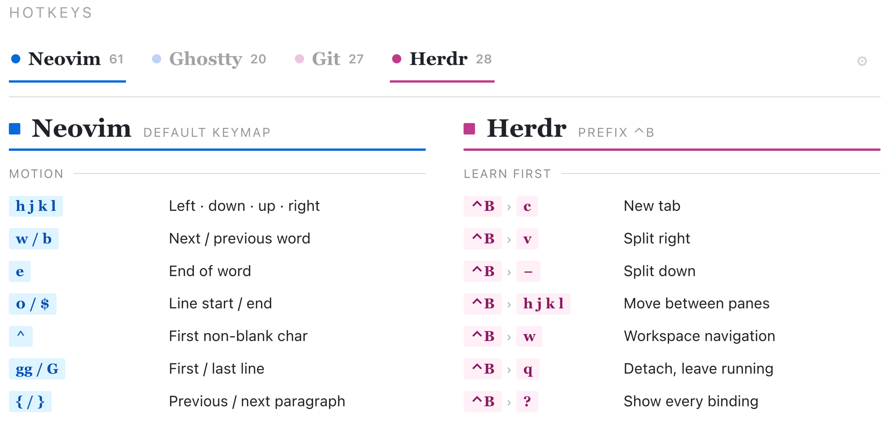

# Hotkeys



A personal hotkeys reference — toggle the tools you're using and it shows their
key bindings; with two or more tools on screen it ranks by star and trims to
fit so everything stays visible at once. Star sections/keys to bump them up
the ranking. The gear icon opens day/night + palette (Default, Catppuccin,
GitHub) settings and a switch to hide the star buttons once you're happy with
the ranking. State (enabled tools, stars, theme) persists in `localStorage`.

Built as a small React + TypeScript app so the hotkey data is a plain typed
dictionary — easy to edit, and to grow beyond a fixed layout later.

## Develop

```sh
npm install
npm run dev
```

Opens on `http://localhost:5173`. Works well on iPad (main target besides
desktop) — the layout collapses to fewer columns as the viewport narrows.

## Build

```sh
npm run build   # type-checks, then outputs static files to dist/
npm run preview # serve the production build locally
```

## Editing the hotkeys

Everything lives in [`src/data/hotkeys.ts`](src/data/hotkeys.ts) as an array
of `ToolDef` (see [`src/types.ts`](src/types.ts)). To add a tool, push a new
entry:

```ts
{
  id: 'my-tool',
  name: 'My Tool',
  kicker: 'short subtitle',
  accent: 'cyan', // or 'magenta'
  groups: [
    { name: 'Group name', keys: [
      { keys: '⌘K', desc: 'What it does' },
      { keys: ['⌃B', 'c'], desc: 'A chorded combo' },
      { keys: 'git status', desc: 'A shell command', mono: true },
    ]},
  ],
}
```

No build step or restart needed — Vite hot-reloads the change.
